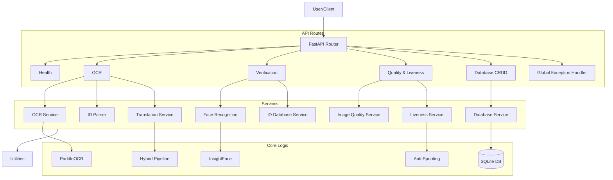

# AI Agent Context Documentation

> [!IMPORTANT]
> **MAINTENANCE INSTRUCTION**: If you make MAJOR changes to the codebase (architecture, new services, significant refactoring), you **MUST** update this file to keep it accurate.
>
> **CRITICAL**: BEFORE updating this file, you **MUST ASK THE USER FOR PERMISSION**. Do not auto-update this file without explicit consent.

## 1. Project Overview
**Name**: e-KYC Verification System
**Goal**: Verify customer identity by comparing ID card images with selfies.
**Core Features**:
- **ID Layout**: YOLO v8 for field detection (Front/Back models).
- **ID Extraction**: PaddleOCR on cropped fields.
- **Face Verification**: InsightFace (Buffalo_L) for face comparison and liveness detection.
- **Translation**: Hybrid Arabic-to-English name translation.
- **Validation**: Configurable strictness.
- **Error Handling**: Standardized exception hierarchy with global handling.
- **Database**: SQLite storage for ID cards, passports, and verification records.

## 2. Architecture

## 3. Directory Structure
- **`api/`**: FastAPI application.
    - **`routes/`**: Modular route handlers.
        - `verification.py`: Core e-KYC verification endpoints.
        - `ocr.py`: ID extraction and parsing.
        - `quality.py`: Image quality and liveness checks.
        - `database.py`: CRUD operations for ID/passport records.
        - `health.py`, `face.py`, `translation.py`.
    - `test_routes.py`: Endpoints for testing and debugging.
    - `test_routes.py`: Endpoints for testing and debugging.
- **`services/`**: Core business logic.
    - `layout_service.py`: YOLO-based field detection (Reduces need for NER).
    - `ocr_service.py`: Text extraction & ID pattern matching.
    - `face_recognition.py`: Face detection & comparison.
    - `id_database.py`: **NEW** - ID card retrieval logic for verification.
    - `database.py`: SQLite database abstraction.
    - `image_quality_service.py`: Face visibility validation.
    - `liveness_service.py`: Passive anti-spoofing checks.
    - `translation_service.py`: Hybrid translation logic.
    - `id_card_parser.py`: Structured data parsing from OCR text.
- **`models/`**: Pydantic schemas (`schemas.py`) and validators.
- **`utils/`**: Shared utilities.
    - `date_utils.py`: **Core** - Centralized date parsing/formatting (YYYY-MM-DD).
    - `config.py`: **CRITICAL** - contains severity thresholds and ID patterns.
    - `exceptions.py`: **NEW** - Centralized Exception Hierarchy (`AppError`, `ServiceError`).
    - `ocr_utils.py`: Preprocessing and text normalization.
- **`data/`**: Local storage for images and SQLite databases.

## 4. Key Engineering Concepts

### A. OCR & Language Detection (`services/ocr_service.py`)
- Uses **PaddleOCR**.
- **Strict Validation**: For non-English models (Arabic), outputs are rejected if they don't contain native script characters.
- **Multilingual**: Detects language per text block.

### B. Hybrid Translation (`services/translation_service.py`)
Pipeline for Arabic-to-English names:
1.  **Dictionary Lookup**: Exact match from `utils/name_dictionary.py`.
2.  **Phonetic Mapping**: Char-by-char transliteration.
3.  **Metaphone Correction**: Uses Double Metaphone to "snap" phonetic output to valid English names.

### C. Validation Severity (`utils/config.py`)
Fields have severity levels determining verification outcome:
- **High** (ID #, Name, DOB): Failure = **REJECT**.
- **Medium** (Dates): Failure = **MANUAL_REVIEW**.
- **Low** (Place of Birth): Failure = **MANUAL_REVIEW** (never rejects).

### D. Modular API Design
- Routes are split by domain in `api/routes/`.
- `main.py` aggregates them via a single router.
- **Verification Flow**: `/verify` endpoint performs OCR, parses data, runs face comparison (with optional liveness), and auto-saves results to the database.

### E. Date Normalization (`utils/date_utils.py`)
- **Single Source of Truth**: All dates are forced to `YYYY-MM-DD`.
- **Robust Parsing**: Handles `DD-MM-YYYY`, `YYYY/MM/DD`, etc.
- **Integrated Services**: Used by `id_card_parser`, `passport_mrz_parser`, and `expiry_date_service`.

### F. Error Handling Strategy (`utils/exceptions.py`)
- **Hierarchy**: Base `AppError` -> `ServiceError` (logic), `ValidationError` (input), `ResourceNotFoundError` (DB), `ModelLoadError` (ML).
- **Global Handler**: `main.py` catches `AppError` and returns consistent JSON error responses.
- **Services**: Raise specific exceptions instead of returning `{"error": ...}` dicts.

## 6. Gap Analysis & Production Readiness
> [!WARNING]
> The following gaps must be closed to meet the requirements for the Enterprise Release.

### Deployment & Architecture
*   **(RESOLVED) Gap (Deployment)**: Missing **Dockerfile** and `docker-compose.yml`.
*   **(RESOLVED) Gap (Deployment)**: ML Models (PaddleOCR, InsightFace) are downloaded at runtime from the internet. **Must be bundled offline** (e.g., in Docker image).
*   **(RESOLVED) Gap (Data Flow)**: System violates "No Persistence" rule by saving images to `data/processed` and. `services/database.py` currently stores blobs. Disabling persistence must be configurable.

### Features & Functional
*   **Gap (Admin)**: Missing **Admin Portal**. No web UI for configuration.
*   **Gap (Admin)**: No **Dynamic Configuration Database**. All config is currently hardcoded in `utils/config.py` or `.env`.
*   **Gap (Admin)**: Missing **RBAC** (Admin vs Read-Only) and **Audit Logs** for config changes.
*   **Gap (Face Match)**: Face Match Score is 0.0-1.0. Requirement: **0-100 normalization**.
*   **Gap (Quality)**: Quality checks missing `is_recoverable` flag to guide user styling.

### API & Interface
*   **(RESOLVED) Gap (API)**: Missing URL Versioning (e.g., `/api/v1/...`).
*   **(RESOLVED) Gap (API/Audit)**: Missing **Transaction ID** (`transaction_id`) in Request/Response headers or body.
*   **Gap (API)**: Missing **Asynchronous/Polling** API support for heavy OCR jobs.
*   **Gap (Error Handling)**: Error responses lack specific error codes (e.g., `ERR_CAM_001`). Currently generic 400/500.

*   **Gap (API 1)**: Missing specific endpoint for **"Document OCR & Data Consistency Check"**.
    *   **Input**: Multipart (JSON Metadata + JSON User Data + Binary Images).
    *   **Logic**: Must combine OCR, Document Validation, Field Comparison, and Translation into one atomic operation.
    *   **Output**: Strict schema with `transliteratedName` breakdown and `dataComparison` arrays.
*   **Gap (API 2)**: Missing specific endpoint for **"Biometric Face Matching & Liveness"**.
    *   **Purpose**: Specialized endpoint completely separate from OCR.
    *   **Constraint**: Response must contain `faceMatch` (Status/Score), `liveness` (Result/Score), and `imageQuality`.
    *   **Gap**: Response must include `finalScore` (requiring cross-reference to API 1 transaction).

### Model Lifecycle & Management
*   **Gap (Model)**: Models are currently auto-downloaded or cached in user home dir. **MUST be "Deployable Artifacts"** (offline packs) under full ONECASH control.
*   **Gap (Model)**: System does not expose **Model Version** in API responses.
*   **Gap (Model)**: System does not log **Model Name & Version** for every transaction.

### Non-Functional
*   **Gap (Performance)**: **Blocking Operations**: `verify_identity` runs CPU-bound ML tasks on the main AsyncIO thread. Must use `run_in_threadpool`.
*   **(RESOLVED) Gap (Security)**: Missing **API Authentication** (API Key/OAuth middleware).
*   **(RESOLVED) Gap (Observability)**: Logs are unstructured text. Requirement: **JSON Structured Logging**.
*   **(RESOLVED) Gap (Observability)**: Missing **Prometheus Metrics** endpoint (`/metrics`).

## 5. Agent Guidelines
- **Running Tests**: Check `docs/TESTING_GUIDE.md`. Preferred script: `python tests/test_verify_enhanced.py`.
- **Config**: Do not hardcode thresholds. Use `utils.config`.
- **New IDs**: Add patterns to `ID_PATTERNS` in `utils/config.py`.
- **Imports**: When importing services, ensure the module exists (e.g., `services.id_database`).
