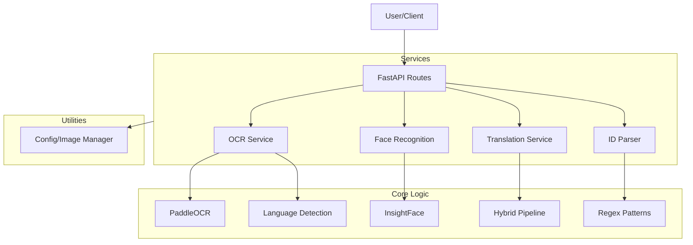

# AI Agent Context Documentation

> [!IMPORTANT]
> **MAINTENANCE INSTRUCTION**: If you make MAJOR changes to the codebase (architecture, new services, significant refactoring), you **MUST** update this file to keep it accurate.
>
> **CRITICAL**: BEFORE updating this file, you **MUST ASK THE USER FOR PERMISSION**. Do not auto-update this file without explicit consent.

## 1. Project Overview
**Name**: e-KYC Verification System
**Goal**: Verify customer identity by comparing ID card images with selfies.
**Core Features**:
- **ID Extraction**: OCR (PaddleOCR) + Pattern Matching for Yemen/Indian IDs.
- **Face Verification**: InsightFace (Buffalo_L) for face comparison.
- **Translation**: Hybrid Arabic-to-English name translation.
- **Validation**: Configurable strictness (Low/Medium/High severity fields).

## 2. Architecture

## 3. Directory Structure
- **`api/`**: FastAPI route handlers (`routes.py`).
- **`services/`**: Core business logic.
    - `ocr_service.py`: Text extraction & ID pattern matching.
    - `face_recognition.py`: Face detection & comparison.
    - `translation_service.py`: Hybrid translation logic.
    - `id_card_parser.py`: Structured data parsing from OCR text.
- **`models/`**: Pydantic schemas (`schemas.py`) and validators.
- **`utils/`**: Shared utilities.
    - `config.py`: **CRITICAL** - contains severity thresholds and ID patterns.
    - `name_dictionary.py`: Static mappings for translation.
- **`tests/`**: Test scripts (e.g., `manual_test_translation.py`, `test_verify_enhanced.py`).
- **`data/`**: Local storage for images (gitignored usually, but structure exists).

## 4. Key Engineering Concepts

### A. OCR & Language Detection (`services/ocr_service.py`)
- Uses **PaddleOCR**.
- **Strict Validation**: For non-English models (Arabic), outputs are rejected if they don't contain native script characters.
- **Multilingual**: Detects language per text block.

### B. Hybrid Translation (`services/translation_service.py`)
Pipeline for Arabic-to-English names:
1.  **Dictionary Lookup**: Exact match from `utils/name_dictionary.py`.
2.  **Phonetic Mapping**: Char-by-char transliteration.
3.  **Metaphone Correction**: Uses Double Metaphone to "snap" phonetic output to valid English names.

### C. Validation Severity (`utils/config.py`)
Fields have severity levels determining verification outcome:
- **High** (ID #, Name, DOB): Failure = **REJECT**.
- **Medium** (Dates): Failure = **MANUAL_REVIEW**.
- **Low** (Place of Birth): Failure = **MANUAL_REVIEW** (never rejects).

## 5. Agent Guidelines
- **Running Tests**: Check `docs/TESTING_GUIDE.md`. Preferred script: `python tests/test_verify_enhanced.py`.
- **Config**: Do not hardcode thresholds. Use `utils.config`.
- **New IDs**: Add patterns to `ID_PATTERNS` in `utils/config.py`.
